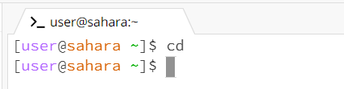
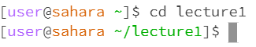
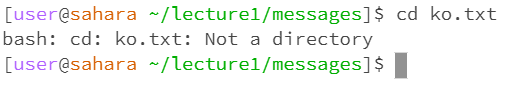
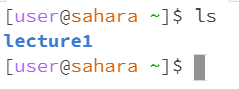
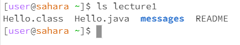
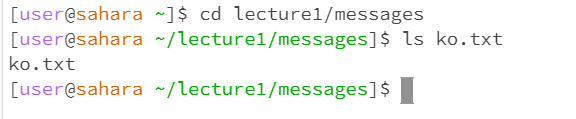
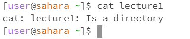
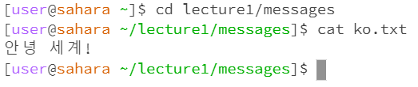

# **LAB REPORT 1**
***

1. cd (Change Directory)
   * Ex 1: 
   * Working directory was /home
   * Nothing happened since I didnt put any directory argument. cd by itself just returned to home.
   * It was not an error because nothing really happens with just cd as a command. cd by itself just returned to home.
  
   * Ex 2: 
   * Working directory was /home
   * It accessed the lecture1 directory since lecture1 is an accessible directory.
   * It was not an error because it successfully accessed the lecture1 directory.
  
   * Ex 3: 
   * The working directory was /home/lecture1/messages
   * It returned a statement that tells the user that ko.txt was not a directory. cd only works with directories, not text files.
   * It was an error because bash returned a statement. It told the user to not use text files as a diectory.
  
2. ls (List)
   * Ex 1: 
   * Working directory was /home
   * It returned the name of a directory, lecture1, since lecture1 is the only directory to list in /home
   * It was not an error because the command, ls, was used correctly.
  
   * Ex 2: 
   * Working directory was /home
   * It returned the names of all the files in lecture1, since lecture1 was the argument used.
   * It was not an error because it successfully listed all the files in lecture1 and was used correctly.
  
   * Ex 3: 
   * Working directory was /home/lecture1/messages
   * It returned the name of the file, ko.txt. It is because ko.txt was the argument used.
   * It was not an error since the ls command was used correctly. It fufilled its purpose by returning the name of the file, ko.txt
  
3. cat (Concatenate)
   * Ex 1: 
   * Working directory was /home
   * It didnt return anything. However, it recieves a user input and return it back to the user until the user decides to end it with Crtl+D.
   * It was not an error because the cat command still accepts inputs from the user without crashing. However, the user does need to manually end the program.
  
   * Ex 2: 
   * Working directory was /home
   * It returned a statement that says that lecture1 is a directory. The cat command usually works for files, not for directories.
   * It was error because bash returned a statement that says that lecture1 is a directory.
  
   * Ex 3: 
   * Working directory was /home/lecture1/messages
   * It returned the contents of the file in ko.txt
   * It was not an error since the ls command was used correctly. It fufilled its purpose by returning the contents of the file.
