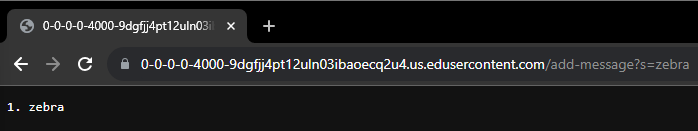
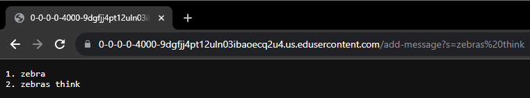
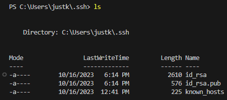
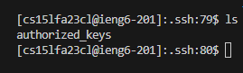
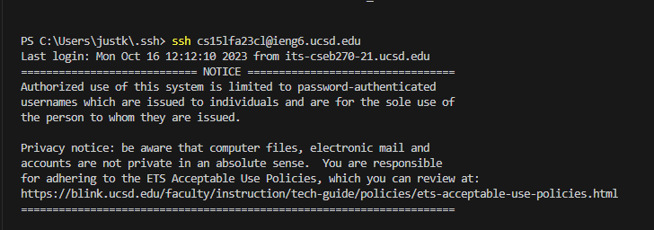

# **LAB REPORT 2**
***
PART I
   * 
   * 
   * The methods mentioned are: `.contains(String s)`, `url.getPath()`, `url.equals(String s)`, `url.getQuery()`, `.split(String s)`
   * Methods/Fields:
       * Methods:
          * contains:
              * param = `+`. This is because in order to send the string back to the user, the server must remove any `+` signs that were used to replace the illegal presence of `' '` in the user's input from the url.
              * param = `/add-message`. This is used in case the user decides to input a message.
          * `url.getPath()`: param = string from path. It is used to determine what to do with the user's input for the url path.
          * `url.equals()`: param = `/`. Used just in case the user has not inputted any string.
          * `url.getQuery()`: used to get the query of the url
          * `url.getQuery.split("=")`: param: `=`. Used to split the string in order to grab the user-inputted string in `parameters[1]`.
      * Fields: `String s`, `String ans`, `int count`, `String input`, `String[] parameters`, `URI url`, `+`, `' '`
   * Relevant fields:
      * `String s`: the string we print out to the user (which comes from the user)
      * `String ans`: this is a local string variable in my custon method: `addSpaces(String s)`. It is not used at all in the screenshot.
      * `int count`: The number of strings the user has inputted so far.
      * `String input`: string used to grab user's inputted string. It is later combined with other strings to make `String s`.
      * `String[] parameters`: used to grab the user's input. Note: any spaces in the input have been replaced with `+`.
      * `URI url`: the url that is used from the user's input on the website.
      * `+`: these are the chars that the url uses to replace an illegal char `' '`.
      * `' '`: we are trying to replace the `+` chars with `' '`, so that we can accurately return the user's string.

***

   * 
   * The methods mentioned are: `.contains(String s)`, `url.getPath()`, `url.equals(String s)`, `url.getQuery()`, `.split(String s)`, `addSpaces(String s)`
   * Methods/Fields:
       * Methods:
          * contains:
              * param = `+`. This is because in order to send the string back to the user, the server must remove any `+` signs that were used to replace the illegal presence of `' '` in the user's input from the url.
              * param = `/add-message`. This is used in case the user decides to input a message.
          * `url.getPath()`: param = string from path. It is used to determine what to do with the user's input for the url path.
          * `url.equals()`: param = `/`. Used just in case the user has not inputted any string.
          * `url.getQuery()`: used to get the query of the url
          * `url.getQuery.split("=")`: param: `=`. Used to split the string in order to grab the user-inputted string in `parameters[1]`.
          * `addSpaces(String s)`
      * Fields: `String s`, `String ans`, `int count`, `String input`, `String[] parameters`, `URI url`, `+`, `' '`
   * Relevant fields:
      * `String str`: the string we print out to the user (which comes from the user)
      * `String ans`: this is a local string variable in my custon method: `addSpaces(String s)`. `ans` is used as a temp variable that holds the correct version of the user's input with `' '` chars instead of `+` chars that come with the url.
      * `String s`: a param used in addSpaces. It's searched through for having `+` chars. If any `+`s are found, the method addSpaces adds a space to `ans`.
      * `int count`: The number of strings the user has inputted so far.
      * `String input`: string used to grab user's inputted string. It is later combined with other strings to make `String s`.
      * `String[] parameters`: used to grab the user's input. Note: any spaces in the input have been replaced with `+`.
      * `URI url`: the url that is used from the user's input on the website.
      * `+`: these are the chars that the url uses to replace an illegal char `' '`.
      * `' '`: we are trying to replace the `+` chars with `' '`, so that we can accurately return the user's string.

***
PART II:
  * private: `C:\Users\justk\.ssh\id_rsa`
  * 

  * public: `cs15lfa23cl@ieng6.ucsd.edu:~/.ssh/authorized_keys`
  * 

  * Term. login
  * 

***
PART III
  * In week 2, I learned how to buld my own server using Java on my ieng6 account. I also learned how to interact with my server without using the same 4000 port number. On week 3, I learned how to use scp and copy keys/files from my pc to the server. However, the most interesting command I found useful was the mkdir command. This can be pretty useful when organizing files.

    
