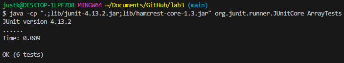
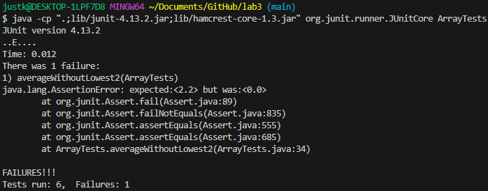
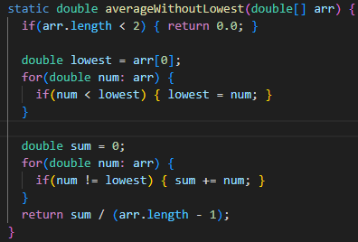
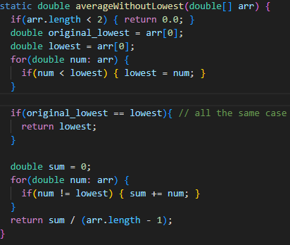

# **LAB REPORT 3**

***
PART I
***

  * Failure inducing input:
  *  `@Test\n`
      `public void averageWithoutLowest2(){`
        `double[] arr =  {2.2,2.2,2.2,2.2};`
        `assertEquals(2.2, ArrayExamples.averageWithoutLowest(arr), 0.0001);`
      `}`
  * 

  * No Failure inducing input:
  * `@Test`
     `public void averageWithoutLowest(){`
        `double[] arr =  {2.2,3.4,5.7,1.1,1.0};`
        `assertEquals(3.1, ArrayExamples.averageWithoutLowest(arr), 0.0001);`
     `}`
  * 

  * Before:
  * 
  * After:
  * 

  * Fixes report:
    * The fix I made was to add in a scenario where the array had multiple doubles that were all equal to each other. The code in the before image did not take into account that the elements in the array could all be equal to each other, therefore when the code ran, it was not able to give the right average. (which was equal to any single double element in the array) 
