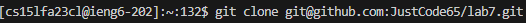
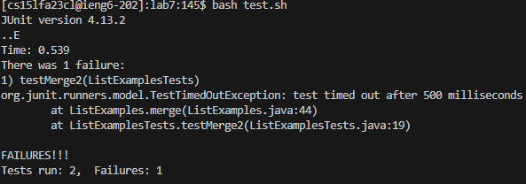
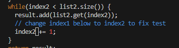
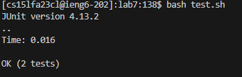
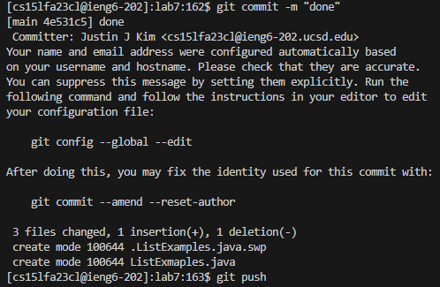

# **LAB REPORT 1**
***

4. '<up><up><up><up><up><up><enter>' The 'ssh cs15lfa23cl@ieng6.ucsd.edu' command was 6 up in the search history. I used the up arrow to access the command. Then the aforementioned command was found, so I pressed the '<enter>' key and ran it.

5. '<up><up><up><up><up><up><up><up><up><enter>' The 'git clone git@github.com:JustCode65/lab7.git' command was 9 up in the search history. I used the up arrow to access the command. Then the aforementioned command was found, so I pressed the '<enter>' key and ran it.

6. '<up><up><up><up><up><up><up><up><up><up><up><up><enter>' The 'bash test.sh' command was 12 up in the search history. I used the up arrow to access the command. Then the aforementioned command was found, so I pressed the '<enter>' key and ran it.

7. '<up><up><up><up><up><up><up><up><up><up><up><up><up><up><up><up><up><up><enter>' The 'vim ListExmaples.java' command was 18 up in the search history. I used the up arrow to access the command. Then the aforementioned command was found, so I pressed the '<enter>' key and ran it.
  - '<down>' key until I reach the line that needs to be fixed. ('<down>' key 43 times). I then decided to press the right arrow button 11 times (<right><right><right><right><right><right><right><right><right><right><right>) to move the cursor above '1'. After that, I press '<x>' to delete '1'. To finally fix the error I press '<i>' to enter insert mode, and then press '<2>'. This changes the '1' to '2'
  - To save and quit the files, I press '<esc>' to return to normal mode and type ':wq' and '<enter>' to do so.
 

8. '<up><up><enter>' The 'bash test.sh' command was 2 up in the search history. I used the up arrow to access the command. Then the aforementioned command was found, so I pressed the '<enter>' key and ran it.

9. Typed: 'git add --all.'. This helps add any changes/files I made to the respository.
- Typed 'git commit -m "done"'. This commits the changes from terminal
- Typed 'git push'. This pushs the changes to my github account.

Time taken
- 5 minutes and 1 second.
