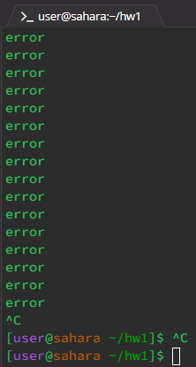
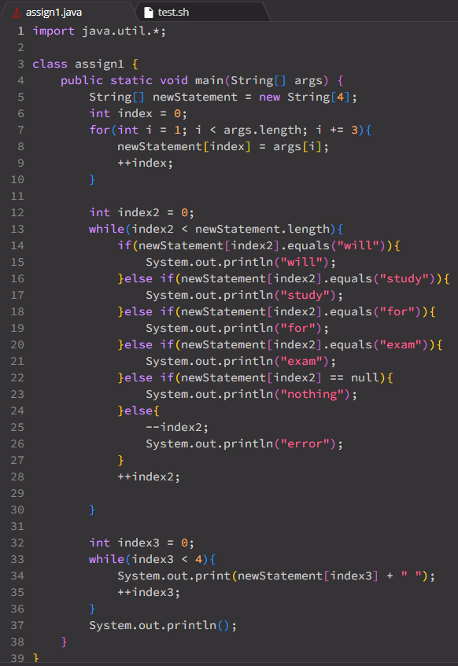
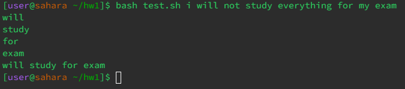
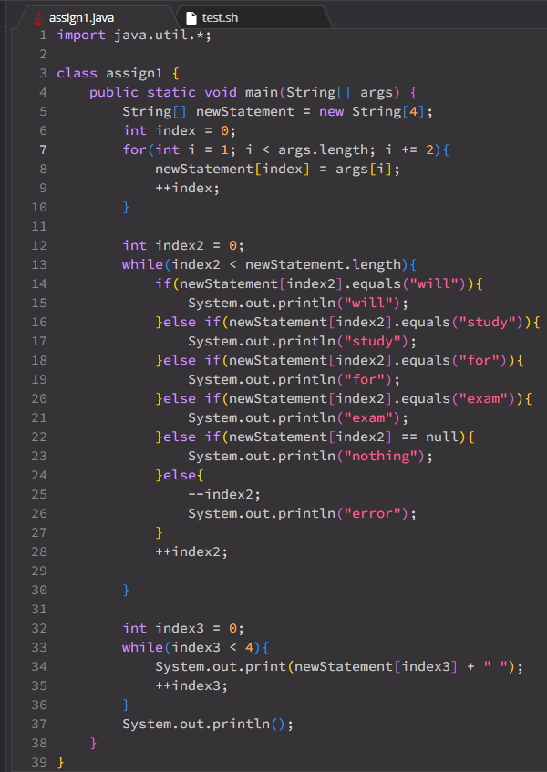
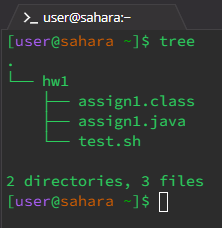

# **LAB REPORT 5**

***
PART I - Debugging Scenario
***

  * Student Post:
  *  --> symptom from term
  *  --> code from java file
  * Hey! I need some help. It seems like my code keeps printing out 'error' without stopping. I have a feeling there might be something wrong with my input or the multiple while loops I have in my code. Can someone help me asap?

  * TA Post:
  * Hey! I just saw your post. I'd recommend checking all your loops, not just your while loops. Make sure they end when they are supposed to end. Also, instead of using print statements, use javac -g and jdb. It might help track down specifically how the infinite loop keeps occurring.

  * Student Post 2:
  *  --> new output
  *  --> fixed code
  * Thanks for your help! At first, I thought there might be something wrong with my while loops. Turns out I acutally had an issue with my for loop. After fixing it, I was able to stop the infinite loop. It seemed like my for loop was ending too early because I accidently added the index by three, instead of 2.

  * Information for set up:
  * 1. File and Directory: 
    2. Java file (broken):
        - ```java
          import java.util.*;
          
          class assign1 {
              public static void main(String[] args) {
                  String[] newStatement = new String[4];
                  int index = 0;
                  for(int i = 1; i < args.length; i += 2){
                      newStatement[index] = args[i];
                      ++index;
                  }

                  int index2 = 0;
                  while(index2 < newStatement.length){
                      if(newStatement[index2].equals("will")){
                          System.out.println("will");
                      }else if(newStatement[index2].equals("study")){
                          System.out.println("study");
                      }else if(newStatement[index2].equals("for")){
                          System.out.println("for");
                      }else if(newStatement[index2].equals("exam")){
                          System.out.println("exam");
                      }else if(newStatement[index2] == null){
                          System.out.println("nothing");
                      }else{
                          --index2;
                          System.out.println("error");
                      }
                      ++index2;
                  }

                  int index3 = 0;
                  while(index3 < 4){
                      System.out.print(newStatement[index3] + " ");
                      ++index3;
                  }
                  System.out.println();
              }
          }
          ```
    4. Test file:
        - ```console
          javac assign1.java
          java assign1 $1 $2 $3 $4 $5 $6 $7 $8

          if [[ $1 != "i" ]] || [[ $2 != "will" ]] || [[ $3 != "not" ]] || [[ $4 != "study" ]] || [[ $5 != "everything" ]] || [[ $6 != "for" ]] || [[ $7 != "my" ]] || [[ $8 != "exam" ]]
          then
              echo "type in the right sentence"
          fi
          ```
    5. Command line: 
        - NOTE: USER MUST SPECIFICALLY TYPE: 'i will not study everything for my exam' (Case sensitive)
        - `bash test.sh i will not study everything for my exam`
    6. Fix: Change the for loop by changing the `i += 3` to `i += 2`.
   

***
PART 2 - Reflection
***

 * From this class, I learned how to use more terminal commnads like grep, xargs, find, etc... I also learned how to commit/add/push code to github and request changes. Overall, this class was incredibly useful. 
