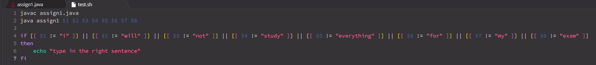

# **LAB REPORT 3**

***
PART I - Debugging Scenario
***

  * Student Post:
  *  --> symptom from term
  *  --> code from java file
  * Hey! I need some help. It seems like my code keeps printing out 'error' without stopping. I have a feeling there might be something wrong with my input or the multiple while loops I have in my code. Can someone help me asap?

  * TA Post:
  * Hey! I just saw your post. I'd recommend checking all your loops, not just your while loops. Make sure they end when they are supposed to end. Also, instead of using print statements, use javac -g and jdb. It might help track down specifically how the infinite loop keeps occurring.

  * Student Post 2:
  *  --> new output
  *  --> fixed code
  * Thanks for your help! At first, I thought there might be something wrong with my while loops. Turns out I acutally had an issue with my for loop. After fixing it, I was able to stop the infinite loop. It seemed like my for loop was ending too early because I accidently added the index by three, instead of 2.

  * Information for set up:
  * 1. File and Directory: 
    2. Java file: 
    3. Test file: 
    4. Command line: 
        - NOTE: USER MUST SPECIFICALLY TYPE: 'i will not study everything for my exam' (Case sensitive)
    6. Fix: Change the for loop by changing the 'i += 3' to 'i += 2'.
